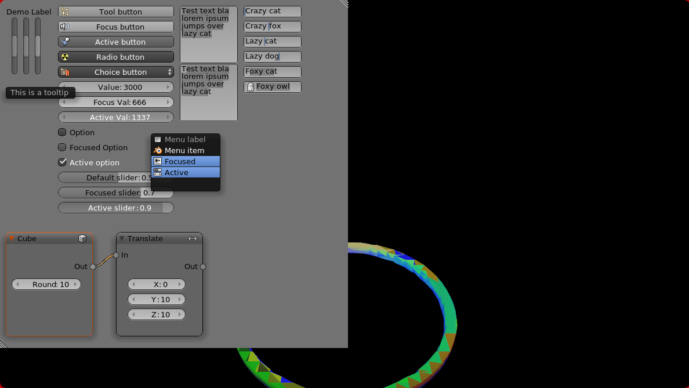

# nanovg-blendish

Port of [oui-blendish](https://hg.sr.ht/~duangle/oui-blendish)
using [nanovg-hs](https://github.com/cocreature/nanovg-hs).

## Project status

* All drawing primitives in place
* No layouting (oui-like) implemented
